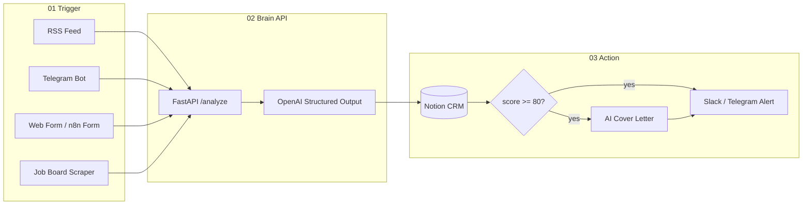

# MatchFlow — Architecture

**MatchFlow** is an automated job-hunting pipeline built for [Place-IL Quest #2](https://www.place-il.org). It separates cleanly from **AseelIndex** (portfolio RAG chatbot): AseelIndex answers recruiters; MatchFlow *finds, scores, and acts on* roles.

## What makes this submission stand out

| Judge criterion | MatchFlow answer |
|-----------------|------------------|
| Full 3-phase flow | RSS + scrape hook + Telegram + web form → Brain → Notion CRM → conditional alerts |
| Reliable AI | Structured JSON (Pydantic + OpenAI) — no fragile free-text parsing |
| Professional polish | Bilingual alerts (HE/EN), dedup by URL, status pipeline, demo script |
| Visual orchestration | Importable **n8n** workflow JSON + documented nodes |
| Your story | Uses *your* real CV; cover letters reference extracted gaps honestly |

## System diagram



## Data model (Notion properties)

Your **Career Quest → Job Hunting** table (complete setup):

| Property | Type | Filled by API |
|----------|------|---------------|
| Company | Title | company name |
| Job Title | Text | role title |
| Job description | URL | job posting link |
| Technologies | Multi-select | Python, FastAPI, … |
| Years Required | Number | years if stated |
| Match Score | Number | 1–100 |
| Match Summary | Text | AI fit explanation |
| Status | Select | starts as `New` |
| Cover Letter | Text | filled when score ≥ 80 |
| Source | Select | `Telegram`, `Rss`, `Manual`, … |
| Processed At | Date | timestamp when analyzed |

**Status options:** `New`, `Reviewing`, `Applied`, `Rejected`  
**Source options:** `Telegram`, `Rss`, `Manual`, `Scraper`, `Form` (Notion creates new tags automatically if missing)

## API contract

`POST /api/v1/analyze`

```json
{
  "job_text": "full posting text or HTML stripped",
  "job_url": "https://optional-link",
  "source": "telegram"
}
```

Response includes `entities`, `match`, `cover_letter` (null if score < threshold), and `should_alert`.

## Deployment options

1. **Local demo**: `uvicorn` brain + `python telegram_bot/bot.py` + n8n desktop importing `n8n/workflows/matchflow-main.json`.
2. **Cloud**: Brain on Railway/Render; n8n Cloud; Notion + Telegram unchanged.

## Security

- Brain API requires `X-API-Key` header (see `.env`).
- Telegram bot whitelists `TELEGRAM_ALLOWED_USER_IDS`.
- Never commit `.env` or real API keys.
